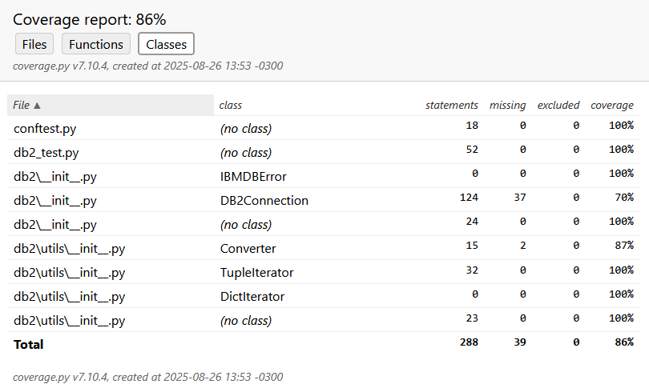
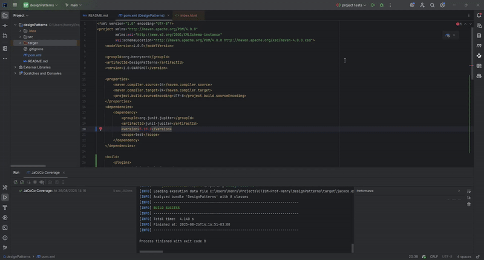

# Software Testing

## Cobertura

Em Python, é possível ver a cobertura dos testes com a biblioteca `coverage`, pela linha de comando:

```bash
pip install coverage
coverage run -m pytest -v
coverage report  # gera um relatório na linha de comando
coverage html  # gera um relatório em HTML
```

O relatório em HTML terá o seguinte aspecto, onde é possível ver a cobertura de arquivos, funções e classes (você 
também pode conferí-lo [aqui](../html/python_coverage.html)):



Em Java, a ferramenta para verificar a cobertura mais popular é o JaCoCo. 

Você pode configurá-la no Intellij IDEA da seguinte forma:

1. Adicione os seguintes plugins ao seu `pom.xml` (**NOTA:** as versões dos plugins e bibliotecas mudarão no futuro e 
   este tutorial ficará defasado. Consulte um tutorial mais atualizado na internet!):

   ```xml
   <build>
        <plugins>
            <!-- JaCoCo plugin for code coverage -->
            <plugin>
                <groupId>org.jacoco</groupId>
                <artifactId>jacoco-maven-plugin</artifactId>
                <version>0.8.13</version>
                <executions>
                    <!-- Attach JaCoCo agent while running tests -->
                    <execution>
                        <goals>
                            <goal>prepare-agent</goal>
                        </goals>
                    </execution>
                    <!-- Generate report after tests -->
                    <execution>
                        <id>report</id>
                        <phase>verify</phase>
                        <goals>
                            <goal>report</goal>
                        </goals>
                    </execution>
                </executions>
            </plugin>
            <plugin>
                <groupId>org.apache.maven.plugins</groupId>
                <artifactId>maven-surefire-plugin</artifactId>
                <version>3.2.5</version>
            </plugin>
            <plugin>
                <groupId>org.apache.maven.plugins</groupId>
                <artifactId>maven-compiler-plugin</artifactId>
                <version>3.13.0</version>
                <configuration>
                    <release>21</release>
                </configuration>
            </plugin>
        </plugins>
    </build>
   ```
   
2. Crie uma nova configuração de execução do Maven:
   
   

3. Um relatório em HTML é gerado e armazenado em `target/site/jacoco/index.html` (você também pode vê-lo 
   [aqui](../html/jacoco.html)):
 
   


## Exercícios

Para cada um dos exercícios abaixo, você deve criar uma classe que encapsule a lógica de negócio, e testes unitários
automatizados para verificar as funcionalidades.

1. **Sistema de Biblioteca (Java)**

   - Crie uma classe `Livro` com os atributos `titulo`, `autor`, `isbn` e `disponivel`.
   - Crie uma classe `Usuario` com os atributos `nome` e `idUsuario`.
   - Crie uma classe `Biblioteca` que gerencie empréstimos, implementando:
     - `emprestarLivro(Livro livro, Usuario usuario)` — só permita empréstimos se o livro estiver disponível.
     - `devolverLivro(Livro livro)` — marque o livro como disponível.
     - Mantenha um histórico de empréstimos.
   - Escreva testes unitários para:
     - Empréstimos de livros disponíveis e indisponíveis.
     - Devolução de livros.
     - Integridade do histórico de empréstimos.

2. **Sistema de Carrinho de Compras (Python)**

   - Crie uma classe `Produto` com os atributos `nome` e `preco`.
   - Crie uma classe `Carrinho` que gerencie produtos, implementando:
     - `adicionar_produto(produto)`
     - `remover_produto(produto)`
     - `calcular_total()` — aplique descontos progressivos:
       - 3 ou mais produtos → 5% de desconto.
       - Total acima de 500 → 10% de desconto.
     - Permita produtos duplicados.
   - Escreva testes unitários para:
     - Diferentes combinações de descontos.
     - Adição e remoção de produtos, recalculando o total.
     - Comportamento com carrinho vazio.

3. **Gerenciador de Contas Bancárias (Java)**

   - Crie uma classe `ContaBancaria` com os atributos `titular`, `numeroConta` e `saldo`.
   - Implemente métodos:
     - `depositar(double valor)`
     - `sacar(double valor)` — lance exceção se o saldo for insuficiente.
     - `transferir(ContaBancaria destino, double valor)` — atualize o saldo das duas contas.
   - Escreva testes unitários para:
     - Saques maiores que o saldo.
     - Transferências entre contas.
     - Depósitos.
     - Integridade do saldo após múltiplas operações.

4. **Sistema de Pedidos com Estados (Java ou Python)**

   - Crie uma classe `Pedido` com os estados `CRIADO`, `PAGO`, `ENVIADO`, `ENTREGUE` e `CANCELADO`.
   - Implemente métodos de transição: `pagar()`, `enviar()`, `entregar()`, `cancelar()`.
   - Lance exceções para transições inválidas.
   - Escreva testes unitários para:
     - Todas as transições válidas.
     - Transições inválidas lançando exceção.
     - Estado final do pedido após múltiplas operações.

