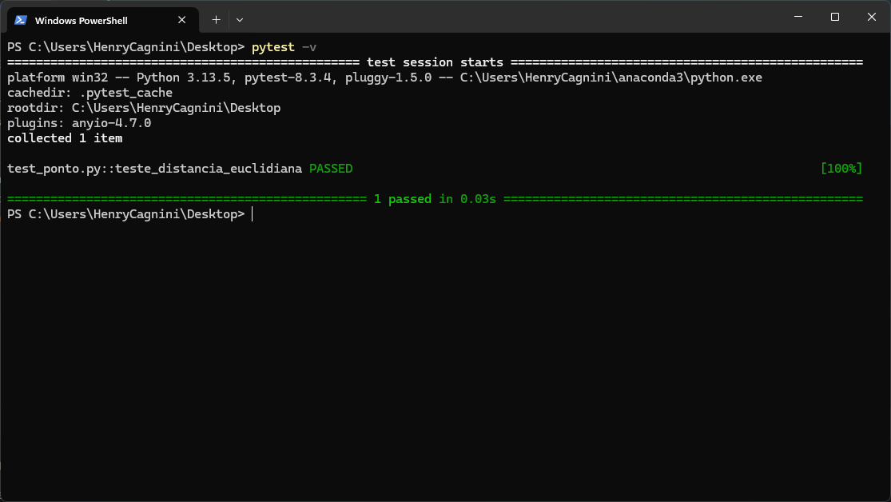

# Testes em Python

Da mesma maneira que Java conta com JUnit para teste unitários automatizados, Python conta com duas bibliotecas, 
[unittest](https://docs.python.org/pt-br/3.13/library/unittest.html), nativa da linguagem, e 
[pytest](https://docs.pytest.org/en/stable), feita por terceiros. Este tutorial explicará como configurar e usar pytest. 
Seu funcionamento é parecido com JUnit, mas é possível agrupar diversos testes em um arquivo.

> [!NOTE]
> Esse tutorial assume que você já tenha baixado e instalado um interpretador Python na sua máquina (de preferência o
> [Anaconda](https://www.anaconda.com/download)), e o diretório de instalação do Anaconda esteja na variável PATH do
> sistema. Caso não esteja, você precisará rodar os comandos com `python -m`

> [!WARNING]
> Java usa `CamelCase` para nomes de arquivos, classes e métodos, enquanto Python usa `snake_case` para nomes de
> arquivos e métodos, e `CamelCase` para nome de classes.


1. Instale pytest com o comando `pip install pytest`
2. Supondo que você tenha um arquivo `ponto.py` com o seguinte código:

   ```python
   class Ponto(object):
        def __init__(self, x: float, y: float):
            self._x = x
            self._y = y

        @property 
        def x(self):
            return self._x

        @property
        def y(self):
            return self._y

        def distancia_euclidiana(self, outro) -> float:
            return (
                (self.x - outro.x)**2 + 
                (self.y - outro.y)**2
            )**(1./2.)
   ```

3. Em um arquivo `test_ponto.py`, escreva o seguinte código (pode colocá-lo no mesmo diretório do arquivo ponto.py):

   ```python
    from pytest import approx
    from ponto import Ponto


    # pytest prefere 'test' à 'teste' 
    def test_distancia_euclidiana():
        p1 = Ponto(0, 0)
        p2 = Ponto(3, 4)

        correta = ((p2.x - p1.x)**2 + (p2.y - p1.y)**2) ** (1./2.)

        assert p1.distancia_euclidiana(p2) == approx(correta, rel=1e-2)
   ```

> [!NOTE]
> Onde colocar os arquivos de teste em um projeto Python? 🤔
> pytest é flexível com relação a organização do projeto. Frameworks (como Django) terão um diretório específico para 
> colocar testes. Mas se você não estiver usando nenhum framework, uma sugestão é ter uma pasta para colocar os testes:
> ```
> meuprojeto/
> │
> ├── geometria/
> │   ├── __init__.py
> │   ├── ponto.py
> │   ├── circulo.py
> │
> ├── tests/
> │   ├── __init__.py 
> │   ├── test_ponto.py
> │   ├── test_circulo.py
> ```

4. No diretório que estão os arquivos `ponto.py` e `test_ponto.py`, execute, pela linha de comando:
   ```bash
   pytest -v
   ```

5. A saída esperada deve ser algo como:

   

## Cobertura

Em Python, é possível ver a cobertura dos testes com a biblioteca `coverage`.

```bash
pip install coverage
coverage run -m pytest -v 
coverage report  # gera um relatório na linha de comando
coverage html  # gera um relatório em HTML
```

Ou, se você estiver com dificuldades de rodar estes comandos:

```bash
pip install coverage
python -m coverage run -m pytest -v 
python -m coverage report  # gera um relatório na linha de comando
python -m coverage html  # gera um relatório em HTML
```

Será gerado um relatório em HTML que pode ser acessado em [htmlcov/index.html](htmlcov/index.html)

